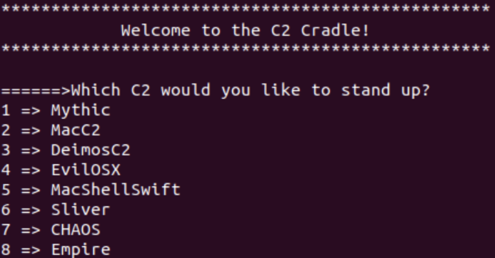
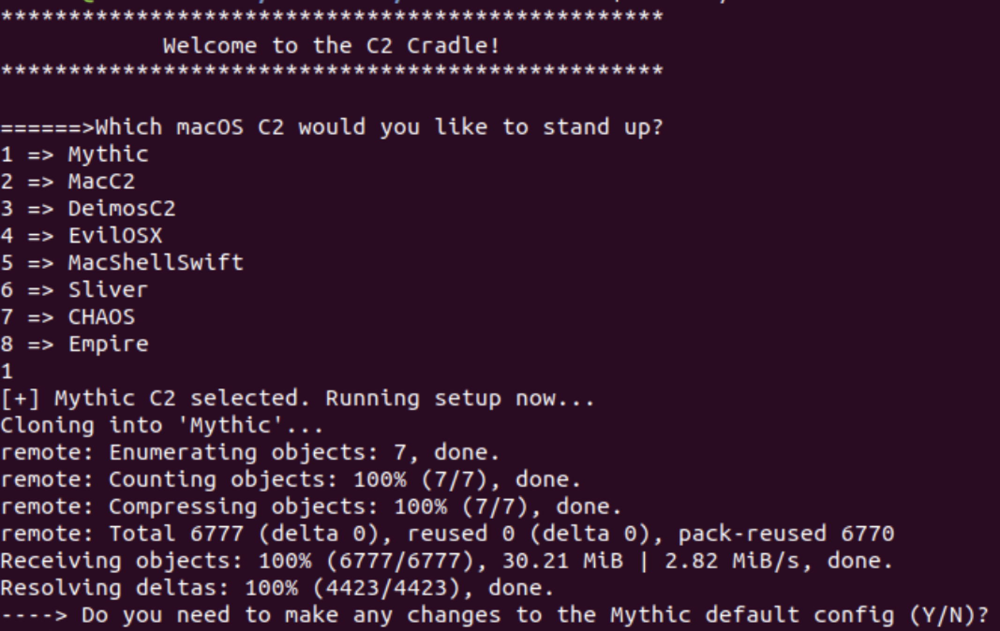
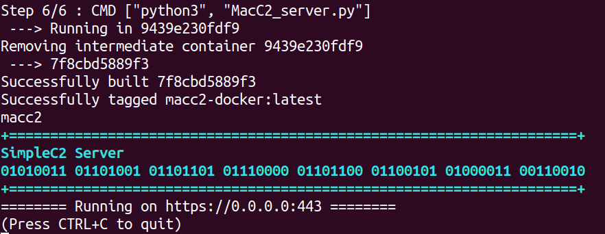

# C2 Cradle
The C2 Cradle is a tool to download, install, and start command &amp; control servers (that have macOS compatible C2 clients) as docker containers. The operator is presented with a list of options to choose from and the C2 Cradle will take it from there and download, install, and start the C2 server in a container. 

**Why?**
1. This can be useful to blue teamers who want to quickly stand up commonly used cross platform C2 frameworks for building detections. This will allow blue teamers to easily accomplish this without having to worry about manually installing dependencies.

2. This may also be helpful for red teams looking to automate C2 setup. This can be coupled with additional automation (ex: Ansible or Terraform) for near push button C2 deployments.

---------------

## Prerequisites

Docker must be installed and running. I have included a docker install script that works with most Linux flavors here if you need to install docker. I did most of my testing on Ubuntu and Kali host machines.

---------------

## Available C2 servers:

### 1. Mythic C2:

**link: https://github.com/its-a-feature/Mythic**

Since Mythic already has a docker image included, I simply run that image. No additional changes were made.

I did not create a shared volume between the Mythic container and the host machine since Mythic includes a web server through which to interact with the container and access files on the container (ex: payloads, C2 artifacts, etc.)

Once the setup is done, by default Mythic will set up the Mythic admin server at https://127.0.0.1:7443. The C2 Cradle script gives you the option to pause during the setup and edit the conf file if you want to change any of this before proceeding with installation and setup:

=============================================

### 2. MacC2:

**link: https://github.com/cedowens/MacC2**

Since I already included a docker image for my MacC2 project, I simply run that image. No additional changes were made.

MacC2 creates shared volume between the host and the MacC2 container located at:
> /var/lib/docker/volumes/macc2

You can use this shared directory to access things such as the macro.txt file, MacC2_client.py, and other C2 artifacts (ex: screenshots, files downloaded, etc).

Once the setup is done, by default the MacC2 https server will listen on 0.0.0.0 port 443. 

The IP/hostname provided during setup will be used to configure the client (MacC2_client.py) as well as the macro generated and dropped at macro.txt. Both of those files can be accessed from inside the MacC2 container at:

> /var/lib/docker/volumes/macc2

=============================================

### 3. Deimos C2:

**link: https://github.com/DeimosC2/DeimosC2**

I built my own docker image for Deimos C2. Here is how the installation and setup works:

- Since the Deimos C2 repo recommends pulling the latest compiled binary as opposed to building from source, I follow that guidance and pull the latest compiled go binary as of the time of this repo (which is https://github.com/DeimosC2/DeimosC2/releases/download/1.1.0/DeimosC2_linux.zip)

- The binary is unzipped and loaded into Docker, where the dependencies are loaded and the DeimosC2 Linux binary is executed to start the Deimos C2 server.

- The Deimos C2 server will start once done and allow you to login on port 8443 and create a Deimos login account. **Note: You will want to ensure that your Deimos C2 server listening on port 8443 is not publicly exposed**

I created a shared volume between the host and the Deimos C2 container located at /var/lib/docker/volumes/deimosc2. However, since Deimos includes a web gui through which to access and manage your C2, you likely won't need the shared volume since you can generate payloads, download payloads, view host artifacts, etc all through the GUI.

### 4. **EvilOSX C2:

I built my own docker image since I had issues with the included one. Here is how the installation and setup works:

- the EvilOSX repo is cloned and my docker image is copied into the repo

- the docker image is built and executed, which will install the dependencies in docker and start the server in cli mode on port 80

- You can then clone EvilOSX on your host machine (or another host) and generate the EvilOSX payload to connect to the server by running python start.py --builder and entering your C2 IP and port information

I created a shared volume between the host and the Deimos C2 container located at /var/lib/docker/volumes/evilosx. Since EvilOSX contains a GUI you likely will not need the shared volume.

### 5. MacShellSwift C2:

Since I already included a docker image for MacShellSwift, I simply run that image. No additional changes were made.

I created a shared volume between the host and the MacShellSwift C2 container located at /var/lib/docker/volumes/MacShellSwift. Here you can access C2 artifacts (ex: screenshots, files downloaded, etc.).

### 6. Sliver C2:

Sliver C2 does have it's own docker image, but I used my own for simplicity. Here is how the installation and setup works:

- the Sliver C2 compiled go binary is downloaded (the latest version during the time of this repo was v1.2.0 and I used the sliver-server_linux.zip file)

- the binary is unzipped and added to the docker image where it is executed

- you will then be brought to the Sliver main menu to select options

I created a shared volume between the host and the Sliver C2 container at /var/lib/docker/volumes/sliverc2.

### 7. CHAOS C2:

CHAOS C2 does not include a docker image so I built one. Here is how the installation and setup works:

- The CHAOS repo is cloned to the host machine

- My dockerfile is copied over to the repo and added in docker, where the go binary is built and started

- After the server is stood up as a docker container, take the following steps:

i. Start a listener on the server:
> listen address=[IP of server] port=[port]

ii. You will need to locally (outside of the container) download CHAOS C2 and generate the payload:

> git clone https://github.com/tiagorlampert/CHAOS && cd CHAOS/cmd/chaos && go build

> cd ../..

> cp cmd/chaos/chaos .

> ./chaos

> generate address=[IP of C2 server] port=[C2 server port] --[platform]

> binary will be dropped in the build directory with a random name

> execute the binary on the target host and the C2 server will show a C2 connection

iii. Docker maps the chaosc2 directory (where the server is running) to the /var/lib/docker/volumes/chaosc2/_data directory on the host. 

### 8. Empire C2:

Since Empire contains its own docker image, I simply use that image. No additional changes were made.

